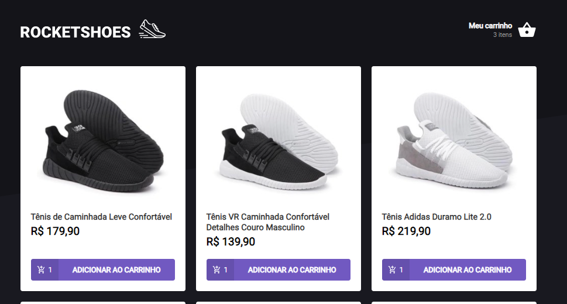
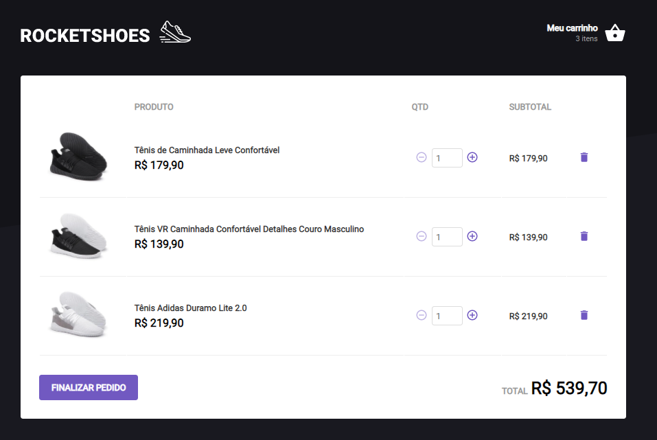

## Iniciando LocalHost
Primeiro, inicie a fake api para ter acesso aos dados dos produtos;

```bash
yarn server
```

## Iniciando LocalHost

```bash
yarn start
```

Abra [http://localhost:3000](http://localhost:3000) no seu navegador para visualizar a aplicação.


<h1 align="center">
  { ROCKETSHOES }
</h1>

<p align="center">
  <a href="#-tecnologias">Tecnologias</a>&nbsp;&nbsp;&nbsp;|&nbsp;&nbsp;&nbsp;
  <a href="#-projeto">Projeto</a>&nbsp;&nbsp;&nbsp;|&nbsp;&nbsp;&nbsp;
</p>


<br>

<p align="center">
  
  
</p>

## 🚀 Tecnologias

Esse projeto foi desenvolvido utilizando:
- ReactJS
- TypeScript
- StyledComponents
- JsonServer
- Axios

## 💻 Projeto

O Rocketshoes é uma aplicação feita em react com o objetivo de simular um ecommerce focado na vendas de tênis. 

## 🧠 Aprendizado

Com esse projeto foi possível aprender sobre chamadas para apis com o intuito de consumi-la. Além disso, foi possível praticar o conhecimento obtido nos módulos das aulas do ignite a respeito de contextos, criação de hooks, estados do react e grande parte das atividades que são feitas em um ambiente de trabalho real.

